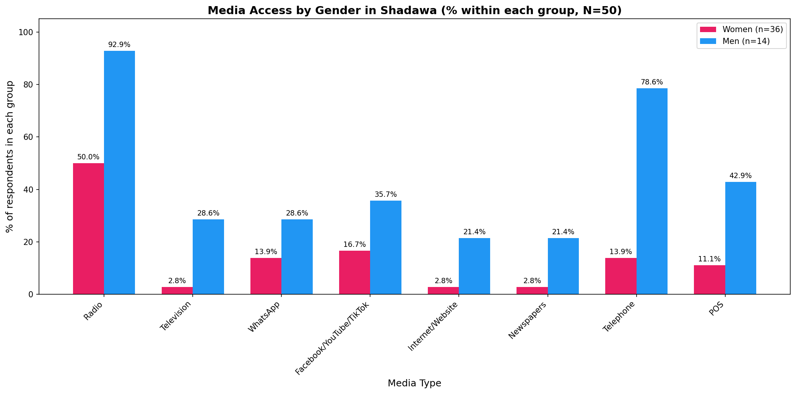

# Shadawa Pastoralist Women Media Empowerment Analysis

**Author:** Abdullahi Isah

**Date:** September 2026

**Tools:** Python (Matplotlib, NumPy)

---

## Overview

This project analyzes media access among pastoralist women in Shadawa, Dawakin Kudu Local Government Area, Kano State. The analysis is based on Round 1 data from the IDRC-SPARC-FUDECO research project on gender equality, empowerment, and social inclusion of pastoralist women.

## Data and Methods

**Source:** Round 1 of the IDRC-SPARC-FUDECO research project (2022), Shadawa settlement, Dawakin Kudu LGA, Kano State. I was a member of the research team. The counts used here are the aggregated figures from the project's report tables.

**Sample:** N = 50 respondents (36 women, 14 men). Results describe this sample and should be treated as indicative, not representative of all pastoralist women.

**Method:** Counts for each media type were parsed in Python, converted to percentages within each gender group (using 36 and 14 as denominators), and compared to identify gender gaps.

**Tools:** Python, Matplotlib, NumPy.

**Data availability:** The aggregated counts are included in the notebook. Individual-level data is not included.

## Key Findings

Percentages are calculated within each group (36 women, 14 men), except where stated as overall.

- **Radio is the gateway:** Radio is the most used medium overall (62% of all 50 respondents) and the only channel with substantial reach among women (50%).
- **Telephone gender gap:** 78.6% of men have telephone access, compared with 13.9% of women, a gap of 64.7 percentage points.
- **Digital divide:** Only 2.8% of women have internet access, and only 16.7% have heard of social media.
- **Women trail men on every channel:** Women's raw counts for radio (18 vs 13) look similar to men's only because women are 36 of the 50 respondents. As a share of each group, women are behind men on every channel measured, for example radio at 50.0% vs 92.9%.

<!-- Chart preview: upload the chart to an images folder, then remove the arrows around the next line

-->

## Recommendations

1. **Prioritize radio:** Design the media empowerment project around radio programming in Fulfulde and Hausa.
2. **Address telephone access:** Explore community phone-sharing models or subsidized handsets for women.
3. **Include a digital literacy component:** Offer basic digital literacy training, but do not rely on it as the primary channel.
4. **Engage men as allies:** Men have much higher access to phones and media in this sample, so include them in awareness and buy-in sessions.

## Limitations

The sample is small (N = 50, including only 14 men). For men, each respondent represents about 7 percentage points, so male percentages can swing widely. These findings should be treated as indicative, not definitive.
